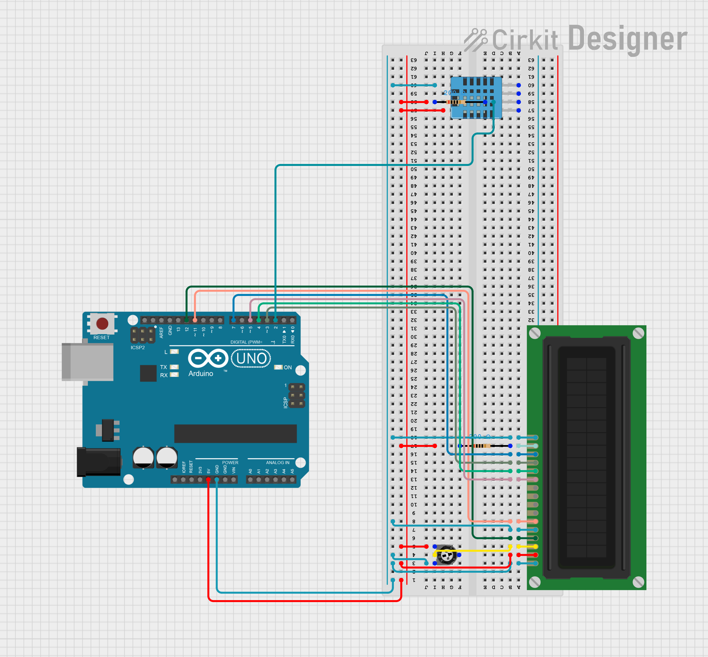

# Arduino Temperature & Humidity Monitor (LCD + DHT11)

This project uses an **Arduino Uno**, a **DHT11 sensor**, and a **16x2 LCD display** to measure and display the **temperature** and **humidity** in a room.  

---

## Components Used

| Component        | Quantity | Description |
|------------------|-----------|-------------|
| Arduino Uno      | 1         | Main microcontroller board |
| DHT11 Sensor     | 1         | Measures temperature and humidity |
| 16x2 LCD Display | 1         | Displays temperature and humidity values |
| 10kΩ Potentiometer | 1       | Adjusts LCD contrast |
| Breadboard       | 1         | For prototyping the circuit |
| Jumper Wires     | Several   | For connections |

---

## Circuit Diagram

Below is the circuit diagram showing how to connect the DHT11 and LCD to the Arduino:

### Wiring Overview

#### DHT11 Sensor
| DHT11 Pin | Arduino Pin |
|------------|-------------|
| VCC        | 5V          |
| GND        | GND         |
| DATA       | Digital Pin **2** |

#### LCD 16x2 Display (in 4-bit mode)
| LCD Pin | Arduino Pin | Description |
|----------|--------------|-------------|
| VSS      | GND          | Ground |
| VDD      | 5V           | Power |
| V0       | Potentiometer middle pin | Contrast control |
| RS       | Pin **12**   | Register select |
| RW       | GND          | Write mode |
| E        | Pin **11**   | Enable |
| D4       | Pin **5**    | Data line |
| D5       | Pin **4**    | Data line |
| D6       | Pin **3**    | Data line |
| D7       | Pin **2**    | Data line |
| A (LED+) | 5V           | LCD backlight power |
| K (LED-) | GND          | LCD backlight ground |

---

## Code Overview

### Features
- Reads temperature and humidity using the **DHT11 sensor**.
- Displays the readings on a **16x2 LCD**.
- Updates values periodically every few seconds.

### Libraries Used
You’ll need to install the following libraries in the Arduino IDE:
- [`DHT11.h`](https://github.com/dhrubasaha08/DHT11)
- [`LiquidCrystal.h`](https://www.arduino.cc/en/Reference/LiquidCrystal)